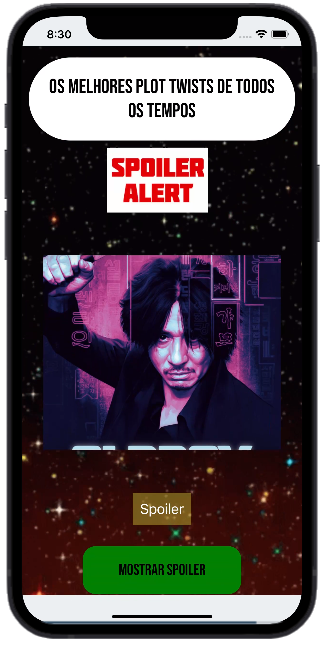
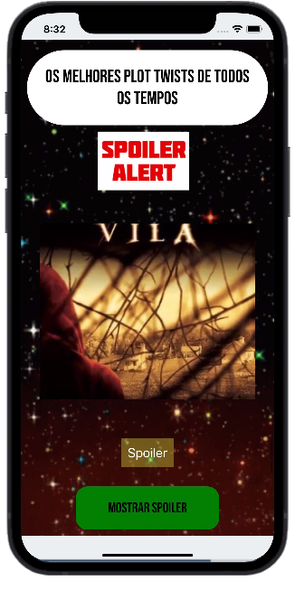

Um app feito para a aula de Mobile I do curso de Desenvolvimento de Sistemas da Etec de Guarulhos. Atividade para usar Flatlist.
  

  <h3>A primeira coisa que a gente vê quando abre o app. O background é um gif</h3>
  

  

  <h3>Ao clicar no botão, o spoiler é revelado</h3>
  

  

  <h3>Por respeito, não tirei print dos outros spoilers</h3>
  

  

agora fiquem com as mensagens do snack
# Sample Snack app

Open the `App.js` file to start writing some code. You can preview the changes directly on your phone or tablet by scanning the **QR code** or use the iOS or Android emulators. When you're done, click **Save** and share the link!

When you're ready to see everything that Expo provides (or if you want to use your own editor) you can **Download** your project and use it with [expo cli](https://docs.expo.dev/get-started/installation/#expo-cli)).

All projects created in Snack are publicly available, so you can easily share the link to this project via link, or embed it on a web page with the `<>` button.

If you're having problems, you can tweet to us [@expo](https://twitter.com/expo) or ask in our [forums](https://forums.expo.dev/c/expo-dev-tools/61) or [Discord](https://chat.expo.dev/).

Snack is Open Source. You can find the code on the [GitHub repo](https://github.com/expo/snack).
